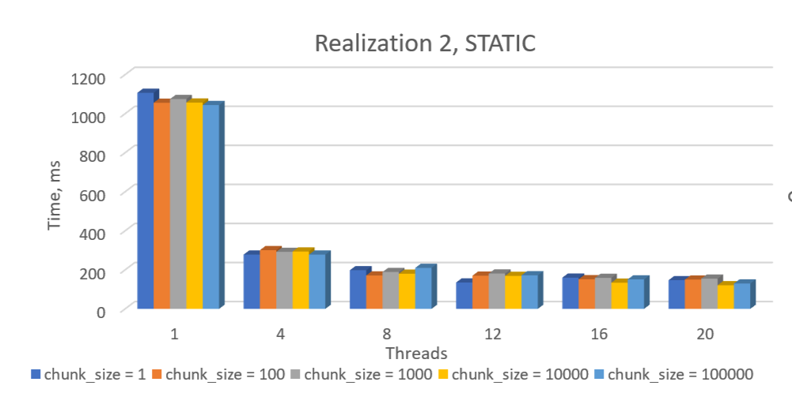
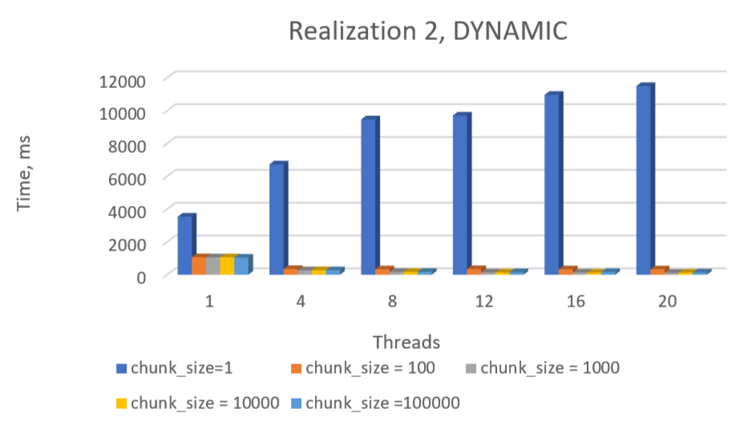
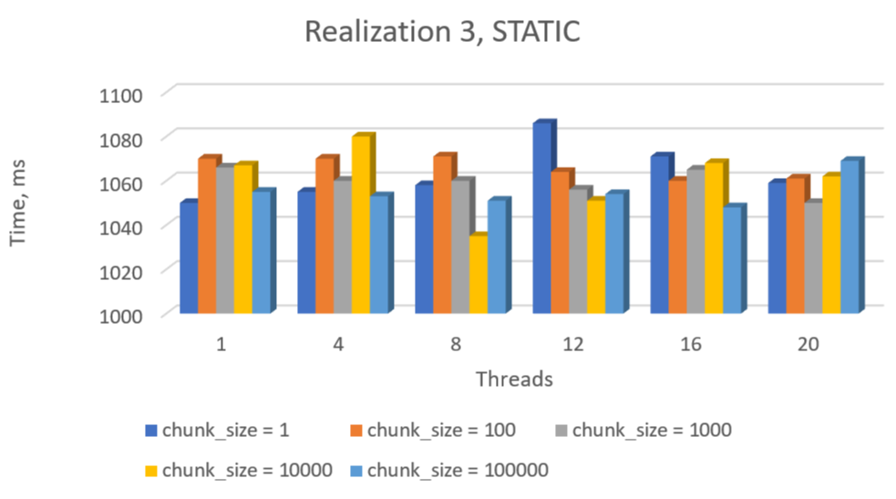
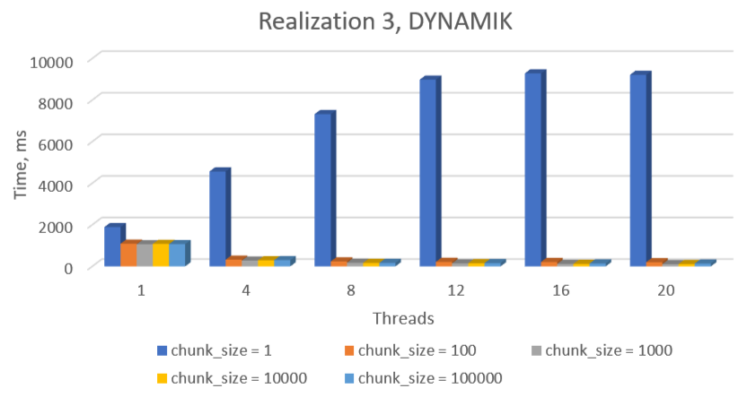
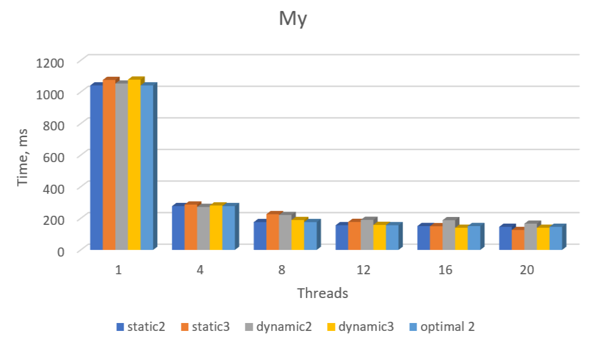
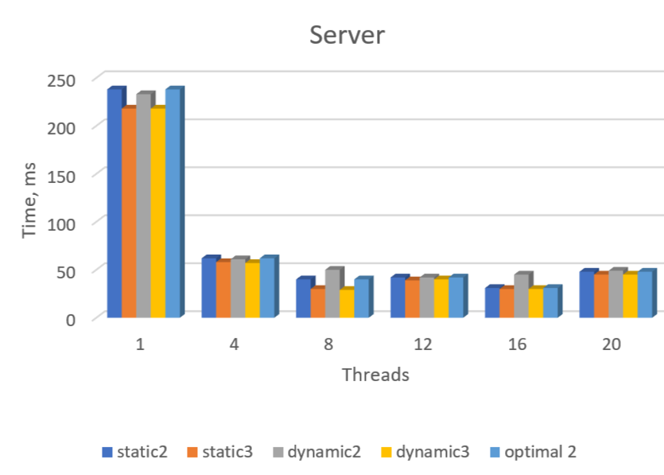

| Лабораторная работа №5    | М3136   | Архитектура ЭВМ |
| ------------------------- | ----------- | ---- |
| Оптимизация по скорости   | Петров Егор Андреевич       | 2024 |

## Инструментарий
> Компилятор: MinGW
> Процессор: 13th Gen Intel(R) Core(TM) i7-13650HX   2.60 GHz
> ОС: Windows

## Что реализовано
Реализовал 3 варианта кода:

1. однопоточная реализация (без OpenMP);

2. многопоточная реализация с автоматическим распределением работы между потоками;
многопоточная реализация с автоматическим распределением работы между потоками;

3. многопоточная реализация, где OpenMP используется только для создания потоков, но не распределения работы между ними.

# Описание:

N = 100000000

> |                                           |
>|:----------------------------------------------------------------------------------------------:|
>| *result realization 2 static* |

> |                                           |
>|:----------------------------------------------------------------------------------------------:|
>| *result realization 2 dynamic* |

> |                                           |
>|:----------------------------------------------------------------------------------------------:|
>| *result realization 3 static* |

> |                                           |
>|:----------------------------------------------------------------------------------------------:|
>| *result realization 3 dynamic* |

> |                                           |
>|:----------------------------------------------------------------------------------------------:|
>| *my graphic* |

> |                                           |
>|:----------------------------------------------------------------------------------------------:|
>| *server graphic* |

## Про генератор

Для реализации лабораторной работы мы использовали метод Монте-Карло, в котором требуется генерация большого количества точек. Следовательно я выбирал генератор который имеет наибольшую скорость выполнения. 

Я рассмотрел lcg и xorshift.Сравнивая их:

LCG:

Умножение: ~3-4 такта.

Сложение: ~1 такт.

Взятие по модулю: ~10-20 тактов (если модуль не степень двойки).

Итого: ~15-25 тактов на одно число.

XOR Shift:

XOR: ~1 такт.

Сдвиг: ~1 такт.

Итого: ~2-3 такта на одно число.

Очевидно, исходя из этого xorshift лучший вариант для нашей работы.
Также xorshift в отличие от lcg имеет хорошее качество случайных чисел, что также делает его более предпочтительным вариантом, чем lcg (страдает от корреляций и неравномерности распределения).

## Оптимальные значения

В результате тестирования и анализа графиков я получил следующие значения:

kind = static

chunk_size: 

kind = static -> 1000

kind = dynamic -> iterations / threads
